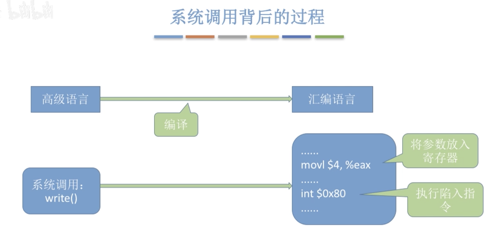
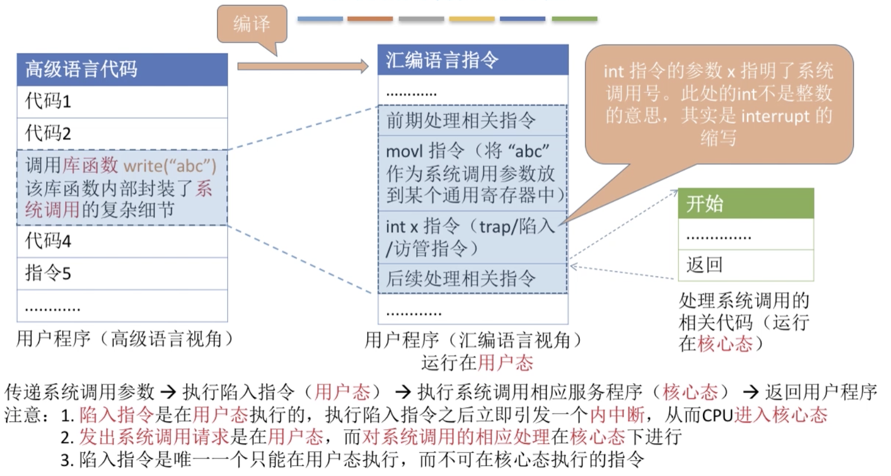

## 目录

- [计算机系统的层次结构](#计算机系统的层次结构)
    - [操作系统提供的功能](#操作系统提供的功能)
    - [操作系统需要提供的接口](#操作系统需要提供的接口)
        - [系统调用](#系统调用)
            - [系统调用与库函数的区别](#系统调用与库函数的区别)
            - [系统调用背后的过程](#系统调用背后的过程)
    - [操作系统的特征](#操作系统的特征)
    - [操作系统的发展与分类](#操作系统的发展与分类)
    - [OS的运行机制和内核以及体系结构](#OS的运行机制和内核以及体系结构)
    - [中断和异常](#中断和异常)
- [进程](#进程)
    - 

- **int 汇编指令 是唯一一个可以在用户态 而不可以 在核心态使用的一个特权指令**
    - 目的是 从用户态陷入到内核态,  并且 传递的参数是在内核态执行的动作

## 计算机系统的层次结构

> **纯硬件  ->操作系统 -> 应用程序(软件) -> 用户**
>
> - 用户可以直接沟通操作系统,也可以直接沟通应用程序
> - 应用程序可以直接沟通操作系统
> - 操作系统直接沟通和控制硬件

- **操作系统概念**
    - **负责管理协调硬件, 软件等计算机资源的工作**
    - **为上层应用程序, 用户提供简单易用的服务**
    - **操作系统是系统软件, 而不是硬件**

### 操作系统提供的功能和目标

- **提供的功能**
    - CPU处理器管理
    - 存储器管理
    - 文件管理
    - 设备管理
- **提供的目标**
    - **实现对硬件机器的拓展**
    - **通常把覆盖了软件的机器称为扩充机器, 也称为虚拟机**

### 操作系统需要提供的接口

- 操作系统提供的所有接口都统称为 **用户接口** 包括三大类:
    - 命令接口 : 允许用户 **直接使用**
        - 联机命令接口 : **交互式命令接口, 用户提供一句命令就执行一句命令**
        - 脱机命令接口 : **批处理命令接口, 用户提供一堆命令 就执行一堆命令**
    - 程序接口 : 允许用户通过 **程序  间接使用**, 由一组 系统调用组成 **(程序接口=系统调用)**
        - 也就是编程开发系统调用接口, 该接口也被称为 **广义指令**
    - GUI : 图像用户接口 

### 系统调用

> **操作系统作为用户和计算机硬件之间的接口,需要向上提供一些简单易用的服务**
>
> **主要包括: 命令接口, 和程序接口, 其中程序接口由一组系统调用组成**
>
> **必须使用系统调用来使用系统资源**
>
> 凡是和资源有关的操作,都必须通过系统调用的方式向操作系统提出服务请求, 由操作系统代为完成,可以**保证系统的稳定性和安全性**, 防止用户非法操作

- **用户接口:**
    - **命令接口(允许用户直接使用)**
        - 联机命令接口 : **交互式命令接口, 用户提供一句命令就执行一句命令**
        - 脱机命令接口 : **批处理命令接口, 用户提供一堆命令 就执行一堆命令**
    - **程序接口(允许用户通过程序间接使用)**
        - **由一组系统调用组成**
        - 应用程序可以发出系统调用来请求获得操作系统的服务sds

- **系统调用的相关处理需要在核心态下进行,都是执行一些特权指令才能完成**

- **系统调用(按功能分类)**
    - **设备管理**: 完成设备  **请求/释放/启动** 等功能
    - **文件管理**: 完成文件的 **读/写/创建/删除** 等功能
    - **进程管理**: 完成进程的 **创建/撤销/阻塞/唤醒** 等功能
    - **进程通讯**: 完成进程之间 **信息传递/信号传递**  等功能
    - **内存管理**: 完成内存的 **分配/回收** 等操作

#### 系统调用与库函数的区别

- 普通应用程序: 可以直接进行系统调用, 也可以使用库函数, 有的库函数设计系统调用,有的不涉及
- 编程语言: 向上提供哭函数. 有时会讲系统调用封装成库函数, 以隐藏系统调用的一些细节,使上层进行系统调用更加方便
- 操作系统: 向上层 提供系统调用

#### 系统调用背后的过程

- 传递系统调用参数
- 执行陷入指令
- 执行系统调用相应的服务程序
- 返回用户程序

## 操作系统的特征

> **并发和共享是两个最基本的特征, 两者互为存在条件**
>
> **操作系统是和程序并发一起诞生的 (多道程序技术)**
>
> **虚拟性 和 异步性都 以及共享性 依赖于并发性**

- **并发性**
    - **并发性是指计算机系统中同时存在着多个运行着的程序**
        - **并发 : `指两个或多个事件在同一时间 间隔内发生. 这些事件在宏观上是同时发生的, 但微观上是交替发生的`**
        - **并行: `指两个或多个时间在同一时刻同时发生`**
            - **并发是单核, 并行必须是双核以上**
- **共享**
    - **共享就是 资源共享, `是指系统中的资源可供内存中多个并发执行的程序共同使用`**
    - **资源共享分为两种方式:**
        - **互斥共享方式: `同一时间段只允许一个进程访问该资源`**
        - **同时共享方式: `允许一个时间段内由多个进程 同时(并行和并发需要区分) 对它们进行访问`**
- **虚拟**
    - **是指把一个物理上的实体变为若干个逻辑上的对应物**
    - **使用的是 `空分复用技术(虚拟存储技术)`,和 `时分复用技术(虚拟处理器)`**
    - **没有并发性, 就谈不上虚拟性**
- **异步**
    - **在多道程序环境下, 允许多个程序并发执行, 但由于资源有限,进程的执行不是一贯到底的,而是走走停停,以不可预知的速度向前推进, 这就是进程的异步性**
    - 出现多个进程资源的抢夺和占用时, 进程会阻塞(仅仅是一瞬间), 等待资源可以获得在解除阻塞.
    - **只有拥有并发性,才可能会导致异步性**

## 操作系统的发展与分类

> **操作系统的发展以及优点,都是解决了上个阶段的主要缺点**

- 手工操作阶段
    - 打孔机和打孔纸袋
    - 主要缺点: 用户独占机, 人机速度矛盾 导致资源利用率极低
- **批处理阶段: `操作系统的雏形`**
    - **单道批处理系统: 引入脱机技术/输入技术(磁带), 并监督程序`(这个程序就是操作系统的雏形)`负责控制作业的输入,输出**
        - `主要是 打孔机(外围机) -> 输入磁带 -> 主机(监督程序) -> 输出磁带 ->打孔机`
        - **主要优点: `缓解了一定程度的人机速度矛盾,资源利用率有所提升`**
        - **主要缺点: `内存仅有一道程序运行,结束后进入下一进程, CPU大量时间在空闲等待I/O完成`**
    - **多道批处理系统 : 每次往内存中输入多道程序,操作系统并引入中断,控制各个程序并发执行**
        - **主要优点: `多道程序并发执行,采用流水线技术, 共享计算机资源,资源利用与大幅提升, CPU和其他资源保持忙碌状态, 系统吞吐量增大`** 
        - **主要缺点: `用户响应时间长, 没有人机交互`**
- **分时操作系统**
    - **分时操作系统: 计算机以时间片为单位 轮流为各个用户/作业服务, 各个用户可通过终端与计算机进行交互**
    - **主要优点:`用户请求可以被即时响应,解决人机交互问题,允许多用户同时使用一台计算机,并且用户对计算机的操作相互独立.感受不到别人的存在.`**
    - **主要缺点: `不能优先处理一些紧急任务.操作系统对各个用户/作业都完全公平,循环的为每个用户/服务一个时间片,不区分任务的紧急性`**
- **实时操作系统**
    - 在实时操作系统的控制下, 计算机系统接收到外部信号后及时进行处理, 并且 **要在严格的时限内处理完 事件** 
    - **主要特点是 及时性和可靠性**
    - **主要优点: `能够响应一些紧急任务, 某些紧急任务不需要时间片排队`**
    - **实时操作系统分为两种系统:**
        - **硬实时系统: `必须在绝对严格的规定时间内处理完成 (自动驾驶,导弹控制)`**
        - **软实时系统: `能接受偶尔违反时间规定 (12306火车订票系统)`**
- 网络操作系统
    - 伴随着计算机网络的发展而诞生的
    - 能把网络中各个计算机有机的结合起来,实现数据传送等功能, 实现网络中各种资源的共享 和各台计算机之间的通讯.
- 分布式操作系统
    - 主要特点是分布性和并行性
    - 系统中的各台计算机地位相同, 任何工作都可分布在这些计算机上, 由他们并行, 协同完成这个任务
- 个人计算机操作系统
    - windows, macOS, Linux 等

## OS的运行机制和内核以及体系结构

> **指令: 是处理器(CPU) 能识别,执行的最基本命令**
>
> **时钟管理, 中断处理, 原语. 都是与硬件关联较为紧密的模块.**
>
> **对系统资源进行管理的功能 根据内核实现不同,可能是内核功能,也可能不是**

- **运行机制**
    - 两种指令
        - 特权指令: 普通用户不可以执行的危险指令, 只有在CPU处于核心态时才可以执行
        - 非特权指令 : 所有人都可以执行的普通指令
    - 两种处理器状态 `用程序状态字寄存器(PSW) 中的某标志位来标识当前处理器处于什么状态.(0,1)`
        - 1.核心态(内核态,管态):  特权指令和非特权指令都可以执行
        - 0.用户态(目态): 此时CPU只能执行 非特权指令
    - 两种程序
        - 内核程序: 操作系统的管理者可以执行的特权指令,运行在核心态
        - 应用程序: 为了保证系统能安全运行, 普通应用程序只能执行非特权指令,运行在用户态
- **操作系统内核 :`底层软件,是OS最基本,最核心的部分`** 
    - 时钟管理
        - 属于内核功能区, 实现计时功能
    - 中断管理
        - 属于内核区, 负责实现中断机制
    - **原语**
        - **SEQ 硬件指令, 是一种特殊的程序,最接近硬件部分, 这种程序运行具有原子性(执行中不可被中断), 运行时间短,调用频繁,主要是设备驱动和CPU状态切换等**
- **对系统资源进行管理的功能**
    - 进程管理
    - 存储器管理
    - 设备管理
- **操作系统的体系结构**
    - 大内核
        - **将操作系统的主要功能模块都作为系统内核, 运行在核心态**
        - **优点: 高性能, 不需要频繁切换核心态和用户态**
        - **缺点: 内核代码庞大, 结构混乱, 难以维护**
    - 微内核
        - **只把最基本的功能保留在内核**
        - **优点: 内核功能少, 结构清晰,方便维护**
        - **缺点: 需要频繁的在核心态和用户态之间切换, 性能低**

## 中断和异常

- **中断机制的诞生**
    - **解决串行执行单个任务时利用率低下的问题**
    - **操作系统(计算机的管理者)引入中断机制,实现多道程序并发执行**
- **中断的概念和作用**
    - **当中断发生时,CPU立即进入核心态**
    - **`用户态到核心态的切换是通过中断实现的, 并且中断是唯一的途径`**
        - 核心态切换到用户态: **通过执行一个特权指令, 将程序状态字(PSW)的标志设置为 用户态**
    - **当中断发生后, 当前运行的进程暂停运行, 并由操作系统内核对中断进行处理**
    - **对于不同的中断信号, 会进行不同的处理**
    - 发生了中断,就意味着需要操作系统进介入, 开展管理工作. 由于操作系统的管理工作(进程切换,分配I/O设备等) 需要使用  **特权指令** ,因此CPU要从用户态转换为核心态.  **中断可以使CPU从用户态切换为核心态, 使操作系统获得计算机的控制权**, 有了中断,才能实现多道程序并发执行
        - CPU收到计时器部件发出的中断信号, 切换为核心态对中断进行处理,将权限交给操作系统
            - 这时操作系统内核负责对中断信号进行处理, 切换需要执行的进程,然后回到用户态继续执行
        - **如果进程发出系统调用(内中断信号), 请求输出, CPU会切换到核心态, 对中断进行处理**
            - 这个时候,该进程会暂停等待, CPU会切换到下一个进程继续执行
    - **本质: `发生中断就意味着 操作系统接入,开展管理工作`** 
- **中断的分类**
    - 信号的来源决定了是内中断还是外中断.
    - **内中断 (也称异常, 例外, 陷入)**
        - **中断来源:来自CPU内部,与当前执行的指令有关**
        - **自愿中断-指令中断**: 系统调用使用的访管指令(陷入指令,trap指令)
        - **强迫中断:**
            - **硬件故障** : 例如缺页
            - **软件中断**: 除数为0
        - **陷阱,陷入(trap)** : 有意为之的异常,  如系统中断
        - **故障(fault):** 由错误条件引起的, 可能会被故障处理程序修复, 如缺页
        - **终止(abort):** 不可恢复的致命错误,程序直接终止
    - **外中断 (硬件中断)**
        - **中断来源:来自CPU外部,与当前执行的指令无关**
        - **外设请求**: 例如 I/O 操作 完成发出的中断信号
        - **人工干预**: 用户强行终止一个进程
- **外中断的处理过程**
    - 每条指令结束后, CPU检查是否有外部中断信号
    - 若有外部中断信号, 则需要保护被中断进程的CPI环境
    - 根据中断信号类型转入相应的中断处理程序
    - 恢复原进程的CPU环境并退出中断, 返回原进程继续向下执行

# 进程

- **定义**
    - 为了方便操作系统管理,完成各程序并发执行, 引入 **进程** 和 **进程实体** 的概念.(进程是动态的,进程实体是静态的)
        - **进程实体(进程映像)  : PCB,程序段, 数据段 三部分组成.(只是静态的记录)**
            - PCB: 系统为每个运行的程序配置的一个数据结构,存放描述进程的各种信息和**操作系统对其进行管理所需的各种信息**
            - **`PCB是进程存在的唯一标志`**
            - **进程实体就是进程**
            - 创建进程, 实质上就是创建进程实体中的PCB, 而撤销进程就是撤销进程实体中的PCB
        - **进程  是进程实体的运行过程, 是系统进程资源分配和调度的一个独立单位** 
- **组成**
    - **进程(进程实体) 由 程序段,数据段,PCB三部分组成**
        - **PCB的组成:**
            - **进程描述信息**
                - 进程标识符 PID
                - 用户标识符 UID
            - **进程控制和管理信息**
                - 进程当前状态
                - 进程优先级
            - **资源分配清单**
                - 程序段指针
                - 数据段指针
                - 键盘
                - 鼠标
            - **处理机相关信息**
                - 各种寄存器
- **组织方式**
- **特征**