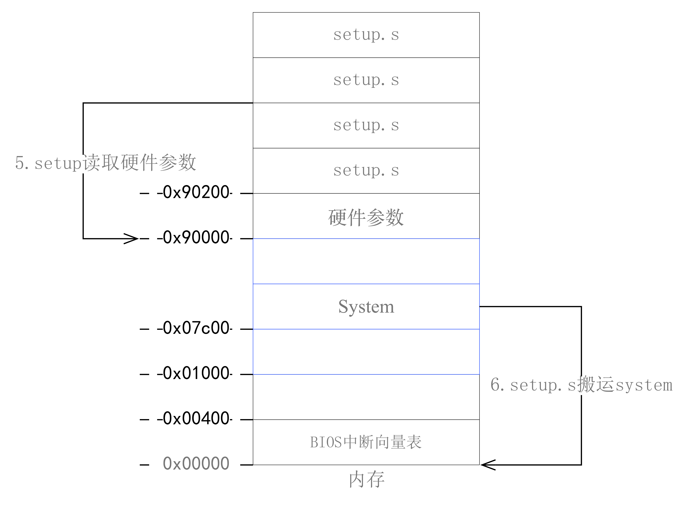

#### 保护模式寻址

##### 5.4.1 保护模式段式寻址

不再采用`segment<<4+offset`的实模式段式寻址模式。

###### 5.4.1.1 段选择符

段寄存器是`选择子`，结构如下

```register
15                          3 2 1     0
+----------------------------+--+--+--+
|        描述符索引           |TI| RPL |		段寄存器/选择子
+----------------------------+--+--+--+
```

1. RPL(Requestor's Privilege Level)，请求者特权级
2. TI(Table Indicator)，表指示器，用于指定选择符所引用的描述符表。TI=0，指定GDT表；TI=1，指定当前的LDT表
3. 描述符索引用于选择指定描述符表中的其中一个。处理器将该索引值乘上8，并加上描述符表的基地址即可访问表中指定的段描述符。

###### 5.4.1.2 段描述符

段描述符放在描述符表中。每一个段描述符占8个字节。

下面是代码段描述符的字节分布：

```register
   63          54 53 52 51 50       48 47 46  44  43    40 39             32
   +-------------+--+--+--+--+--------+--+----+--+--------+----------------+
   | BaseAddress |G |B |0 |A |Segment |P | D  |S |  TYPE  | BaseAddress    | 
   |   31...24   |  |  |  |V | Limit  |  | P  |  |        |   23...16      |
   |             |  |  |  |L | 19...16|  | L  |1 | 1|C|R|A|                |
   +-------------+--+--+--+--+--------+--+----+--+--------+----------------+
   31                               17 16                                  0
   +----------------------------------+------------------------------------+
   |            BaseAddress           |                Segment             |                 
   |             15...0               |                 Limit              |
   |                                  |                 15...0             |
   +----------------------------------+------------------------------------+
```

下面是中断门描述符的字节分布：

```register
   63                               48 47 46  44 43    40 39  37 36      32
   +----------------------------------+--+----+--+--------+-+-+-+----------+
   |                                  |P | D  |S |        |     |          | 
   |     Procedure Entry Address      |  | P  |  |  TYPE  |0 0 0| Reserved |
   |          31...16                 |  | L  |0 | 1|1|1|0|     |          |
   +-------------+--+--+--+--+--------+--+----+--+--------+-+-+-+----------+
   31                               17 16                                  0
   +----------------------------------+------------------------------------+
   |                                  |                                    |                 
   |       Segment Selector           |      Procedure Entry Address       |
   |                                  |              15...0                |
   +----------------------------------+------------------------------------+
```

###### 5.4.1.3 段式寻址过程图     

虚拟基址经过段式寻址方式转化为线性地址，转换过程如下：

     

###### 5.4.1.4 进入保护模式

进入保护模式前需要设置好使用的段描述符表，包括全局描述符表`GDT`和中断描述符表`IDT`

1. `lidt`加载中断描述符表寄存器`IDT`

```asm
!           idt_48
!47       32|31     16|15       0
! -32bit linear addr- | len of idt
lidt idt_48
```

lidt用于加载中断描述符表寄存器(IDT)。它的操作数(idt_48)有6字节。
前2字节(字节0-1)是描述符表的字节长度值；后4字节(字节2-5)是描述符表的32位线性基地址。    

2. `lgdt`加载全局描述符表寄存器`GDT`

```asm
lgdt gdt_48
```

指令格式同`lidt`     

3. lmsw(load machine status word) 切换到保护模式

```asm
mov	ax,#0x0001	! protected mode (PE) bit
lmsw ax
```

加载机器状态字，也就是控制寄存器CR0，其比特位0置1将导致CPU切换到保护模式，并且运行在特权级0中
在Intel公司的手册上建议80386或以上CPU应该使用指令`mov cr0, ax`切换到保护模式。`lmsw`指令
仅用于兼容以前的286CPU。

4. 跳转到内存地址0处的`system`模块

```assembly
jmpi	0,8		! jmp offset 0 of segment 8 (cs)
```

寻址方式如[段式寻址过程图](#段式寻址过程图)所示

##### 5.4.2 分页机制

###### 5.4.2.1 页表项格式

页目录表和页表的表项格式如下所示：

```register
   31                                            12 11  9 8 7 6 5 4 3 2 1 0
   +-----------------------------------------------+-+-+-+-+-+-+-+-+-+-+-+-+
   |                                               |  A  |   | | |   |U|R| | 
   |              Page Frame Address               |  V  |0 0|D|A|0 0|/|/|P|
   |                                               |  L  |   | | |   |S|w| |
   +-----------------------------------------------+-----+-+-+-+-+-+-+-+-+-+
```

下图给出二级页表的查找过程。其中CR3寄存器指定页目录表的基地址。线性地址的高10位([31:22])用于索引这个页目录表，以获得指向相关第二级页表的指针。线性地址的中间10位([21:12])用于索引二级页表，以获得物理地址的高20位。线性地址的低12位直接作为物理地址低12位，从而组成一个完整的32位物理地址。    


#### 5.5 向下兼容引起的“多此一举”

##### 5.5.1 bootsect.s的流程图

	

计算机上电，BIOS初始化中断向量表之后，会将启动设备的第一个扇区(即引导扇区)读入内存地址`0x07c00(31kb)`处，并跳转到此处执行，由此系统的控制权由BIOS转交给bootsect.s。而为了方便加载内核模块，bootsect.s首先将自己移动到`0x90000(576kb)`处。这样的移动是多此一举。	

##### 5.5.2 setup.s流程图

			
计算机上电后，BIOS会在物理地址0处开始初始化中断向量表，其中有256个中断向量，每个中断向量占用4个字节，共1KB，在物理内存地址`0x00000-0x003fff`处，这些中断向量供BIOS中断使用。这就要求，如果操作系统的引导程序在加载操作系统时使用了BIOS中断来获取或显示一些信息时，内存中这最开始的1KB数据不能被覆盖。而操作系统的内核代码最好起始于物理内存开始处，这样内核空间的代码地址等于实际的物理地址，便于对内核代码和数据进行操作，这就需要将内核代码加载到内存`0x00000`处。如此就产生了矛盾。所以`bootsect.s`在载入内核模块时，先将其加载到`0x10000`处，之后`setup.s`利用BIOS中断读取完硬件参数，再有`setup.s`将内核模块从`0x10000-0x8ffff`处搬运到`0x00000-0x7ffff`处。这样先加载内核模块到其他地方再移到到内存起始位置是多此一举。

