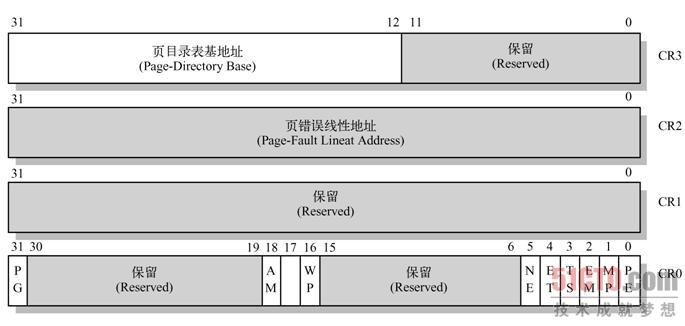

#### 80x86寄存器结构

80x86寄存器 CPU共有一般分为5类：

1. 数据寄存器
2. 段寄存器
3. 控制寄存器
4. 指针寄存器
5. 段基址寄存器

具体分类如下：

```register
80x86 registers
|——通用寄存器
|	|——数据寄存器
|	|	|——EAX
|	|	|	|——AX -> |AH|AL|
|	|	|——EBX
|	|	|	|——BX -> |BH|BL|
|	|	|——ECX
|	|	|	|——CX -> |CH|CL|
|	|	|——EDX
|	|		|——DX -> |DH|DL|
|	|
|	|——指针寄存器
|	|	|——堆栈指针寄存器
|	|	|	|——ESP
|	|	|	|	|——SP
|	|	|——基址指针寄存器
|	|		|——EBP
|	|			|__BP
|	|
|	|——变址寄存器
|		|——源变址寄存器
|		|	|——ESI
|		|	|	|——SI
|		|——目的变址寄存器
|			|——EDI
|				|——DI
|
|——控制寄存器
|	|——指令指针寄存器
|	|	|——EIP
|	|	|	|——IP
|	|——标志寄存器
|	|	|——EFLAGS
|	|	|	|——FLAGS
|	|——控制寄存器0
|	|	|——CR0
|	|——控制寄存器1
|	|	|——CR1
|	|——控制寄存器2
|	|	|——CR2
|	|——控制寄存器3
|		|——CR3
|
|——段寄存器
|	|——代码段寄存器
|	|	|——CS
|	|——数据段寄存器
|	|	|——DS
|	|——堆栈段寄存器
|	|	|——SS
|	|——附加段寄存器
|		|——ES
|		|——FS
|		|——GS
|
|——段基址寄存器
|	|——全局描述符表寄存器
|	|	|——GDTR
|	|——中断描述符表寄存器
|	|	|——IDTR
|	|——局部描述符表寄存器
|	|	|——LDTR
|	|——任务状态寄存器
|		|——TR
```

##### 5.3.1 段寄存器使用约定

| 访问存储区类型     | 缺省段寄存器 | 可指定段寄存器 | 段内偏移地址来源       |
| ------------------ | ------------ | -------------- | ---------------------- |
| 取指令码           | CS           | 无             | IP                     |
| 堆栈操作           | SS           | 无             | SP                     |
| BP用作基地址寄存器 | SS           | CS DS ES       | 依寻址方式寻找有效地址 |
| 串操作源地址       | DS           | CS DS ES       | SI                     |
| 串操作目的地址     | ES           | 无             | DI                     |
| 一般数据存取       | DS           | CS DS ES       | 依寻址方式寻找有效地址 |

##### 5.3.2 EFLAGS标志寄存器

```register
31                            18 17 16 15 14 13 12 11 10 9  8  7  6  5  4  3  2  1  0
+-------------------------------+--+--+--+--+--+--+--+--+--+--+--+--+--+--+--+--+--+--+
|                               |V |R |0 |N | IO  |O |D |I |T |S |Z |0 |A |0 |P |1 |C |
|                               |M |F |  |T | PL  |F |F |F |F |F |F |  |F |  |F |  |F |
+-------------------------------+--+--+--+--+--+--+--+--+--+--+--+--+--+--+--+--+--+--+
```

1. **CF : 记录相关运算指令执行后,  无符号数运算   最高有效位向更高的假想位 进位或借位 时 该值为1.当AL=98H , `add AL,AL`,执行后CF=1,   进位标志**
2. PF(Parity Flag)：奇偶标志位，记录相关运算指令执行后, 其结果中 1 的个数是否为偶数, 1的个数为偶数或0 时 PF=1, 当1的个数为奇数时 PF=0, 
3. AF(Assistant Flag)：辅助进位标志位
4. ZF(Zero Flag)：零标志位，记录相关运算指令执行后, 其结果为0时 那么 ZF标志位=1 , 否则 ZF=0
5. SF(Signal Flag)：符号标志位，记录相关运算指令执行后, 其结果是否为负数, 如果结果为负数那么 SF=1, 非负数 SF=0
6. **TF : 跟踪标志, 单步执行指令,处理器会在每条指令执行后产生一个调用异常, 可使用 `POPF, POPFD 或 IRET` 设置该标志**
7. IF(Interrupt Flag)：中断允许标志位，由`CLI`，`STI`两条指令来控制；设置IF位使CPU可识别外部(可屏蔽)中断请求，复位IF位则禁止中断；IF位对不可屏蔽外部中断和故障中断的识别没有任何作用
8. DF(Direction Flag)：方向标志位，由`CLD`，`STD`两条指令控制；复位DF标志位，字符串操作指令中`SI`，`DI`值自增；设置DF位字符串操作指令中`SI`，`DI`值自减
9. OF(Overflow Flag)：溢出标志位，记录相关运算指令执行后,  有符号数运算 是否发生溢出, 溢出OF=1, 没有溢出 OF=0
10. IOPL(I/O Privilege Level)：I/O特权级字段，宽度2位，只用于控制IO访问, 可屏蔽硬件中断,调试,任务切换,以及虚拟8086模式, 只有当 CPL小于等于这个IOLP才能访问I/O地址空间, 而且CPL为特权级0时, 程序才可以使用 `POPF 或 IRET` 指令修改这个字段.   该标志还控制对 IF标志的修改机制之一
11. **NT: 控制中断返回指令`IRET`, 控制着被中断任务和调用任务之间的链接关系.递归调用**
12. **RF: 恢复标志, 控制处理器对断点指令的响应  `IRETD` 来设置, 为1时会禁止断点调试**
13. VM: 虚拟8086模式, 设置时, 开启虚拟8086模式, 当为0时 ,则回到保护模式

**使用 `pushf` 和 `popf` 指令来获得和修改 eflags 寄存器**


CR寄存器



- **CR0寄存器**
  - PG ：控制分页， 为1时启动分页机制
  - PE ：保护模式， 为1时驱动保护模式
  - 


