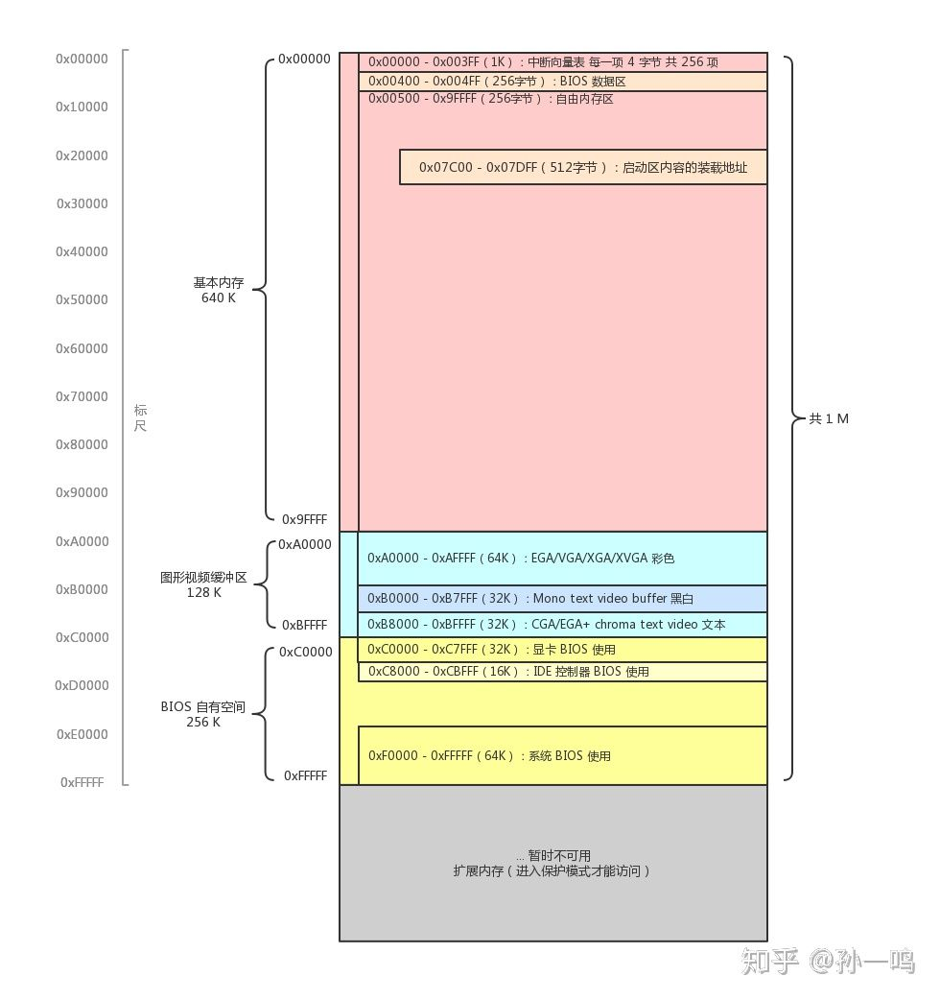

- [实模式下内存分布](#实模式下内存分布)
- [编写主引导扇区](#编写主引导扇区)
  - [在0xB8000到0xBFFFF内存位置有32KB空间, 这部分是VGA显卡的映射区可以直接写入要显示的文字](#在0xB8000到0xBFFFF内存位置有32KB空间, 这部分是VGA显卡的映射区可以直接写入要显示的文字)
  - [范例将一串字符显示在屏幕上](#范例将一串字符显示在屏幕上)
  - [真正的主引导扇区编写](#真正的主引导扇区编写)
  - 


## 实模式下内存分布




## 编写主引导扇区

**MBR 启动扇区**

- 扇区记录方法
  - CHS
  - LBA  (一般都是这种)


### 在0xB8000到0xBFFFF内存位置有32KB空间, 这部分是VGA显卡的映射区可以直接写入要显示的文字

**每个 在屏幕上显示的ASCII 码字符, 后面都跟着一个属性字节,  字符加属性 一共占据2字节宽度**

属性占据1字节, 属性每个位都有作用: 0 1 2 是字体颜色RGB,  3是是否闪烁, 4 5 6 是背景颜色RGB , 7 未知


### 范例将一串字符显示在屏幕上

> **创建工作目录   `NASM/VSrules/`**
>
> **创建文件 main.sam**

```cassandra
; MBR ASMFORGE, 启动扇区

	jmp start   ; 起始地址 , 0x7c00

;  设置显示的字符,  'A‘是显示的字 , 0x07 黑底白字 字的属性, szText是地址,而不是指令, szText就是指向 'A' 的地址
; 该字符串的首地址就是  0x07c0:szText   段地址加偏移值
szText db 'A', 0x07, 'S', 0x07, 'M' , 0x07, 'F', 0x07, 'O' , 0x07 ,'R', 0x07, 'G', 0x07, 'E', 0x07

start:
	;赋值段寄存器ds 数据段,  段寄存器不可以直接使用 立即数 赋值
	mov  ax, 0x07C0
	mov  ds, ax      ; 段地址
	mov  si, szText  ; 偏移地址 , DS:SI 指的就是 szText字符串的首地址
		
	mov  ax, 0xB800
	mov  es, ax      ; 显存的内存映射地址
	mov  di, 0       ; 地址偏移值, es=0xB800, di=0x000  , ES:DI= 0xB800:0000 ->左移四位= 0xB8000

	mov  cx, (start - szText) / 2  ; 字符串长度, 将字和属性 算作一个

	
	rep movsw        
; movsw m16,m16   ; DS:SI 挪移到 ES:DI   2Bytes == 1Word , 将DS内容复制到ES, SI内容复制到DI, 一次性复制两个字节
	
halt:
	jmp  halt
	jmp  halt
	jmp  halt	
	jmp  halt
	
	
times  510-($-$$) db 0 ; $指的是当前地址, $$指的是段的起始地址 0x7c00, ($-$$) 会得到段起始地址到目前地址的距离
					   ; 510 减去前面的内容长度 会得到剩下的内容长度, 使用 db 将结果长度赋值成0
					   ; 填充中间的空闲区域
 
	db 0x55, 0xaa    ; MBR启动扇区的最后两个字节的必需品,也是确认当前是启动扇区的主要标识符
	                 ; 或者写成 db 0xaa55 小端表示法
```


> 使用   `nasm -fbin main.asm -o main.bin`  来生成 main.bin 可引导文件
>
> 再使用  `dd  if=main.bin  of=a.img bs=512`  转换成磁盘文件
>
> 使用 bochs软件 来进行模拟和运行   
>
> [bochs手册](bochs使用手册.md)


## 真正的主引导扇区编写

> `div bx  ;  结果 0x1000 放在 AX寄存器, 余数放在 DX寄存器, 段地址计算, 0x10000 / 16 = 0x1000`

> **`dd if=main.bin of=a.img bs=512`  指定写入的文件**
>
> **`dd if=2.bin of=a.img seek=100`  a.img这个文件是存在的. 将2.bin内容写到逻辑扇区编号100处,物理扇区的101号位置(物理扇区从1开始编号, 逻辑扇区从0开始编号**)

