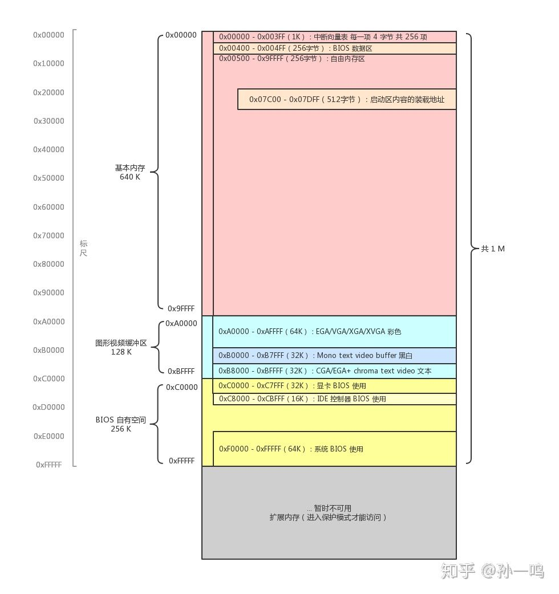

- [实模式和保护模式](#实模式和保护模式)

- [启动过程](#启动过程)

- [跳转步骤](#跳转步骤)

- [实模式下内存分布](#实模式下内存分布)

  

> **因为使用的是  8086CPU, 最高支持1MB内存, 地址总线为20根. 最高位内存地址 0xFFFFF ,  最低 0x00000**

> ROM 只读存储器,   RAM 随机存储器

> **前置知识:**
>
> 1. 内存是存储数据的地方，给出一个地址信号，内存可以返回该地址所对应的数据。
> 2. CPU 的工作方式就是不断从内存中取出指令，并执行。
> 3. CPU 从内存的哪个地址取出指令，是由一个寄存器中的值决定的，这个值会不断进行 +1 操作，或者由某条跳转指令指定其值是多少。
> 4. 计算机刚开机的时候只有 1M 的内存可用
> 5. **内存地址, 并不全都是指向内存的, 有一部分的地址是指向外围硬件设备, 通过总线来进行, 也就是说绝大部分地址指向内存, 一小部分地址指向硬件设备, 通过读写这一小部分的内存地址位置,可以相当于操作这些设备, 这就是内存映射**
> 6. 数据 从低地址向高地址 推进

[寄存器和CPU说明](CPU_8086和ASM汇编.md)

**指令是从 低地址向高地址 读取和执行**

## 实模式和保护模式

> - **实模式**
>   - 就是正常 8086 的 16位模式, 可以随意访问和修改 1MB内存的所有内容, 都是物理内存地址直接访问的,没有保护
> - **保护模式**
>   - 通过段选择的方式对内存进行了保护, 由实模式切换而来

## 启动过程

1. 开机键按下, CPU上电后 会初始化寄存器 CS 和 IP 寄存器
   1. 将CS 初始化为 0xFFFF,  代码段寄存器
   2. 将IP  初始化为 0x0000
   3. **整合之后就是 CS:IP  =   0xFFFF0 从这里开始执行代码, 只有16字节, 一般放置 jmp 指令 跳转到另一个区域**
      1. 从 0xFFFF0 向  0xFFFFF 处执行,  从低到高
   4. **在开机的一瞬间，CPU 的 PC 寄存器被强制初始化为 0xFFFF0**。
      1. 再说具体些，CPU 将 段基址寄存器 cs 初始化为 0xF0000，将偏移地址寄存器 IP 初始化为 0xFFFF0.
      2. 根据实模式下的最终地址计算规则，将段基址CS 左移 4 位，加上偏移地址，得到最终的物理地址也就是抽象出来的 PC 寄存器地址为 0xFFFF0  ;  ( 0xFFFF << 4  = 0XFFFF0   顶出的位会被记录 )
2. **会来到 `ROM  BIOS` 中执行, 将 ROM BIOS的内容 映射到内存 (这是系统 BIOS)**
   1. **BIOS会存放到内存的最高处,   占据了 最顶端的 64KB  ( 0xFFFFF 到 0xEFFFF)**
   2. **CPU来到 0xFFFF0 内存地址处开始执行**
3. **根据存在于 0xFFFF0 的代码, 跳转到 0xFE05B 位置，开始执行**
   1. **这部分的 BIOS 代码 主要做的内容就是初始化硬件**
4. **根据 BIOS 最后的内容, 会将 磁盘的第一个扇区  512b 字节的数据读取到一个内存位置 `0x07C00`, 然后通过 jmp指令 跳转到这个位置开始执行, 也就是转移控制权**
   1. 这个磁盘的第一个扇区 就是 **主引导扇区 (MBR)**
      1. **这个扇区的特点是 :  521字节中, 最后两位字节永远是 0x55 和 0xAA**
      2. 如果查找不到, 就返回没有启动盘的信息
   2. CS:IP = 0x07C00  内存地址就是 0x07C00,  CS = 0x0000 , IP = 0x7C00
   3. **把磁盘换成 USB 也是同理,  BIOS 可以让你选择使用哪个设备启动, 那么哪个设备的第一个扇区就会拷贝到固定位置,再移交控制权**
5. **主引导扇区会 加载内核和其他的内容到内存, 然后 再移交控制权给内核即可**

## 跳转步骤

1. 按下开机键，CPU 将 PC 寄存器的值强制初始化为 0xffff0，这个位置是 BIOS 程序的入口地址（一跳）
2. 该入口地址处是一个跳转指令，跳转到 0xfe05b 位置，开始执行（二跳）
3. 执行了一些硬件检测工作后，最后一步将启动区内容加载到内存 0x7c00，并跳转到这里（三跳）
4. 启动区代码主要是加载操作系统内核，并跳转到加载处（四跳）

## 实模式下内存分布

