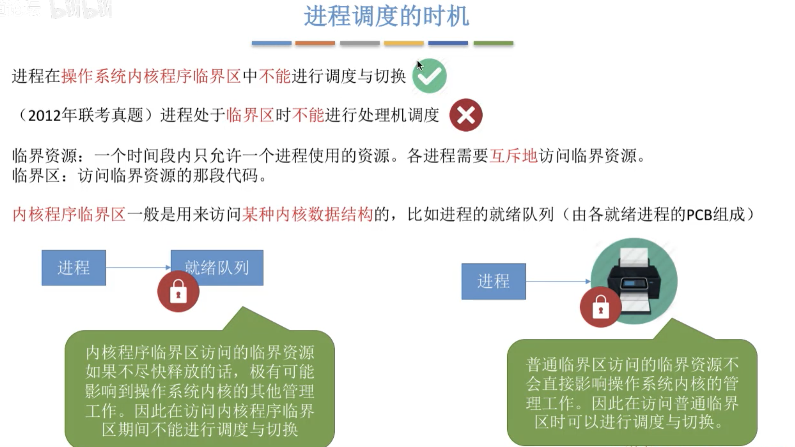

## 目录

- [进程](#进程)
    - [进程的状态与转换](#进程的状态与转换)
    - [进程控制](#进程控制)
    - [进程通信](#进程通信)
    - [线程概念和多线程模型](#线程概念和多线程模型)
    - [处理机调度-概念-层次](#处理机调度-概念-层次)
    - [进程调度的时机,切换与过程,方式](#进程调度的时机,切换与过程,方式)
    - [调度算法的评价指标](#调度算法的评价指标)
    - [调度算法](#调度算法)
    - [进程同步和进程互斥](#进程同步和进程互斥)
    - 

# 进程

- **定义**
    - 为了方便操作系统管理,完成各程序并发执行, 引入 **进程** 和 **进程实体** 的概念.(进程是动态的,进程实体是静态的)
        - **进程实体(进程映像)  : PCB,程序段, 数据段 三部分组成.(只是静态的记录)**
            - PCB: 系统为每个运行的程序配置的一个数据结构,存放描述进程的各种信息和**操作系统对其进行管理所需的各种信息**
            - **`PCB是进程存在的唯一标志`**
            - **进程实体就是进程**
            - 创建进程, 实质上就是创建进程实体中的PCB, 而撤销进程就是撤销进程实体中的PCB
        - **`进程  是进程实体的运行过程, 是系统进程资源分配和调度的一个独立单位`**
- **进程的组成**
    - **进程(进程实体) 由 程序段,数据段,PCB三部分组成**
        - **PCB的组成:  `进程管理者(操作系统)所需要的这个进程的数据,都存在于PCB中`**
            - **进程描述信息**
                - 进程标识符 PID : 系统分配的唯一ID,用于区分不同的进程
                - 用户标识符 UID: 标示运行该进程的用户
            - **进程控制和管理信息**
                - 进程当前状态
                - 进程优先级
            - **资源分配清单**
                - 程序段指针
                - 数据段指针
                - 键盘
                - 鼠标
            - **处理机相关信息**
                - 各种寄存器值: 进程切换时, 将进程的运行情况记录下来,PC程序寄存器的值,和寄存器的值
        - **程序段: 存放要执行的代码**
        - **数据段: 存放程序运行过程中处理的各种数据**
- **进程的组织: `多个进程之间的组织方式`**
    - 链接方式
        - 按照进程状态将 PCB分为多个队列
        - 操作系统持有指向各个队列的指针
            - **执行指针 : `指向当前处于运行态(执行态)的进程.只可以指向一个PCB`**
                - **单 CPU计算机中, 同一时刻只会有一个进程处于运行状态**
            - **就绪队列指针: `指向当前处于就绪态的进程,数据结构为队列`**
                - 通常会把优先级高的进程放在队头
            - **阻塞队列指针:  `指向当前处于阻塞态的进程队列,很多操作系统还会根据阻塞原因不同,再分为多个队列`**
    - 索引方式
        - 根据进程状态的不同, 建立几张索引表
        - 操作系统持有各个索引表的指针
            - **执行指针 : `指向当前处于运行态(执行态)的进程.只可以指向一个PCB`**
                - **单 CPU计算机中, 同一时刻只会有一个进程处于运行状态**
            - **就绪表指针: `指向当前处于就绪态的进程表,表中每项都指向一个PCB`**
            - **阻塞表指针 : `指向当前处于阻塞态的进程表,表中每项都指向一个PCB`**
- **进程的特征**
    - **动态性: `进程是程序的一次执行过程, 是动态产生,变化和消亡的`**
    - **并发性: `内存中有多个进程实体, 各进程可并发执行`**
    - **独立性: `进程是能独立运行, 独立获得资源, 独立接受调度的基本单位`**
    - **异步性: `各进程按各自独立的, 不可预知的速度向前推进,操作系统要提供 '进程同步机制' 来解决异步问题`**
    - **结构性: `每个进程都会配置一个PCB, 结构上看, 进程和程序段, 数据段, PCB组成`**

### 进程的状态与转换

- **进程的状态与转换**
    - **状态**
        - **运行状态**: 有CPU和其他所有资源
        - **就绪状态**: 有其他所有资源, 只缺少CPU资源
        - **阻塞状态**: 没有任何资源. 等待某个事件发生,然后回到就绪态,去抢占资源
        - 创建状态: 操作系统为新进程分配资源, 创建PCB
        - 终止状态: 操作系统回收进程的资源, 撤销PCB
    - **进程状态间的转换:`所有状态的转换,都需要修改PCB的内容,并且都是原子操作`**
        - **就绪态  -->  运行态: `进程被调度`**
        - **运行态  -->  就绪态: `时间片到, 或CPU被更高优先级的进程抢占`**
        - **运行态  -->  阻塞态: `等待系统资源分配, 或等待某事件发生( 主动行为)`**
        - **阻塞态  -->  就绪态: `资源分配到位, 等待的事件已经发生(被动行为)`**
        - 创建态  -->  就绪态: `系统完成创建进程相关的工作`
        - 运行态  -->  终止态: `进程运行结束, 或者运行过程中晕倒不可修复的错误`

### 进程控制

**进程控制的主要功能是对系统中的所有进程实施有效的管理, 它具有创建新进程, 撤销已有进程, 实现进程状态转换等功能**

**`进程控制就是要实现进程状态转换`**

- **用原语实现进程控制, 原语的特点是执行期间不允许中断, 必须全部执行完成,这种操作称为原子操作**
    - **原语 采用 "关中断指令" 和 "开中断指令" 实现**
        - **这两个指令的权限非常大, 只允许在 核心态下执行的特权指令.**
- **进程控制会导致进程状态的转换, 无论哪个原语, 要做的无非三类事情:**
    - **1.更新PCB中的信息`(如 修改进程状态标志, 将运行环境保存到PCB,从PCB恢复运行环境)`**
        - 所有的进程控制原语一定都会修改进程状态标志
        - 剥夺当前运行进程的CPU使用权, 必然需要保存其运行环境
        - 某进程开始运行前必然要恢复其运行环境
    - **2.将PCB插入合适的队列**
    - **3.分配/回收资源**

> 创建原语
>
> 

> 撤销原语
>
> 

> 进程的阻塞与唤醒原语 : 因为什么事件被阻塞, 就应该因为什么事件被唤醒, 也必须成对出现
>
> 

> 进程的切换原语
>
> 

## 进程通信

> **进程是分配系统资源的单位(包括内存地址空间), 因此各进程拥有的内存地址空间相互独立**
>
> - 为了保证安全, 一个进程不能直接访问另一个进程的地址空间
>     - **需要通过操作系统提供的方法来进行安全的通信**

- **进程通讯**
    - **共享存储** `两个进程通过一块共享空间进行通讯,但该空间的访问对两个进程而言必须是互斥的`
        - 基于数据结构的共享:  两进程共享一种数据结构. 低级通信方式,速度慢,操作系统控制
        - 基于存储区的共享 : `在内存中划出一块共享存储区,数据存放到那里,由进程控制.速度快,高级通信方式`
    - **消息传递**
        - 
            - 传递结构化的消息 (消息头和消息体)
            - 系统提供  "发送/接受 原语"
            - **两种方式:**
                - **直接通信**: 消息直接挂到接收方的消息队列里
                - **间接通信**  : 消息先发到中间体(信箱)
    - **管道通信**
        - **Linux下, 管道默认长度为 4k**
        - 
            - 设置一个特殊的共享文件 (管道PIPE), 其实就是个缓冲区 (默认4K)
            - **一个管道只能实现半双工通信**
            - **实现双向同时通信要建立两个管道**
            - 各进程互斥访问管道
            - 写满时, 不能再写, 读空时, 不能再读
            - 没写满,不能读, 没读空, 不能写

## 线程概念和多线程模型

## 处理机调度-概念-层次

- **处理机高级调度**

    - 

- **处理机中级调度**

    - 

- **处理机低级调度**

    - 

- **三层调度的联系和对比**

    - 

    

> **挂起状态和七状态模型**
>
> 

**总结**

## 进程调度的时机,切换与过程,方式

>  **进程调度（低级调度），就是按照某种算法从就绪队列中选择一个进程为其分配处理机**

> **进程调度的时机**
>
> - **非剥夺调度方式, 又叫非抢占式: `实现简单, 系统开销小但是无法及时处理紧急任务,适合于早期的批处理系统`**
>     - **系统只允许进程主动的放弃处理机,而不允许进程在运行中被迫的剥夺处理机资源**
>
> - **剥夺调度方式, 又称抢占式: `可以优先处理更紧急的进程，也可实现让各进程按时间片轮流执行的功能（通过时钟中断）。适合于分时操作系统、实时操作系统`**
>     - **有的系统中,进程可以主动放弃处理机,当有更紧急的任务需要处理时,也会强行剥夺处理机(被动放弃)**
>
> - **进程在普通临界区中是可以进行调度以及切换的**
>
> 

> **进程在操作系统内核程序临界区中不能进行调度与切换**
>
> 

> **进程的切换与过程**
>
> - **“狭义的进程调度”与“进程切换”的区别:**
>     - **狭义的进程调度**  指的是从就绪队列中选中一个要运行的进程。（这个进程可以是刚刚被暂停执行的进程也可能是另一个进程，后一种情况就需要进程切换）
>     - **进程切换**  是指一个进程让出处理机，由另一个进程占用处理机的过程。
> - **广义的进程调度包含了选择一个进程和进程切换两个步骤**
> - 进程切换的过程主要完成了如下步骤:
>     - 对原来运行进程各种数据的保存
>     - 对新的进程各种数据的恢复
>         - 如：程序计数器、程序状态字、各种数据寄存器等处理机现场信息，这些信息一般保存在进程控制块
> - 注意：**进程切换是有代价的**，因此如果 **过于频繁** 的进行进程 **调度、切换**，必然会 **使整个系统的效率降低** 使系统大部分时间都花在了进程切換上，而真正用于执行进程的时间减少。

## 调度算法的评价指标

- **调度算法的评价指标**
    - CPU利用率 
        - 指 CPU“忙碌”的时间占总时间的比例
            - **`利用率= 忙碌时间/总时间`**
        - 除了CPU占用路还有外围硬件占用率,这个利用率只出现在支持单道程序的计算机, 这个就是 `外围利用率=外围硬件忙碌时间/程序运行总时间`
            - 多道程序并发执行,应该使用 甘特图来进行辅助计算
    - 系统吞吐量
        - 单位时间内完成作业的数量
            - **`系统吞吐量=总共完成作业数/总花费的时间`**
    - 周转时间
        - 是指从作业被提交给系统开始，到作业完成为止的这段时间间隔
        - 它包括四个部分：
            - 作业在外存后备队列上等待作业调度（高级调度）的时间、
            - 进程在就绪队列上等待进程调度(低级调度)的时间、
            - 进程在CPU上执行的时间、
            - 进程等待/O操作完成的时间。
                - 后三项在一个作业的整个处理过程中，可能发生多次
        - **`作业周转时间 = 作业完成时间 - 作业提交事件`**  用户更关心这个指标,越小越好
        - **`平均周转时间 = 各作业周换时间之和 / 总作业数`**  操作系统的整体表现指标, 越小越好
        - **`带权周转时间=(作业周转时间/作业实际运行的时间) = (作业完成时间-作业提交时间)/作业实际运行时间`**
            - 该值一定大于等于 1,越小越好
        - **`平均带权周转时间 = 各作业带权周转时间之和/ 作业数`**  ,越小越好
    - 等待时间
        - 指进程或作业 **处于等待处理机状态时间之和** , 等待时间越长,用户满意度越低。
        - **`平均等待时间= 所有进程作业的等待时间 / 进程作业数量`**
        - 对于进程来说,等待时间就是指进程建立后等待被服务的时间之和,在等待/O完成的期间其实进程也是在被服务的，所以不计入等待时间。
        - 对于作业来说，不仅要考虑建立进程后的等待时间，还要加上作业在外存后备队列中等待的时间
        - 一个作业总共需要被CPU服务多久,被/O设备服务多久一般是确定不变的,因此调度算法其实只会影响作业/进程的等待时间。当然,与前面指标类似,也有“平均等待时间”来评价整体性能。
    - 响应时间
        - 指从用户提交请求到首次产生响应所用的时间。

## 调度算法

**饥饿:  `某进程/作业  长期得不到服务`**

- **先来先服务 (FCFS)**
    - 
    - 
- **短作业优先(SJF)**
    - 
    - 
    - 
    - 
    - 
- **FCFS 算法是在每次调度的时候选择一个等待时间最长的作业（进程）为其服务。但是没有考虑到作业的运行时间，因此导致了对短作业不友好的问题**
- **SJF 算法是选择一个执行时间最短的作业为其服务。但是又完全不考虑各个作业的等待时间，因此导致了对长作业不友好的问题，甚至还会造成饥饿问题**

> **高响应比优先**
>
> 
>
> 

- **时间片轮转 (RR,  Round-Robin)**
- 

- **优先级调度算法**
- 

- **多级反馈队列调度算法**
- 
- 

- **总结**

## 进程同步和进程互斥

